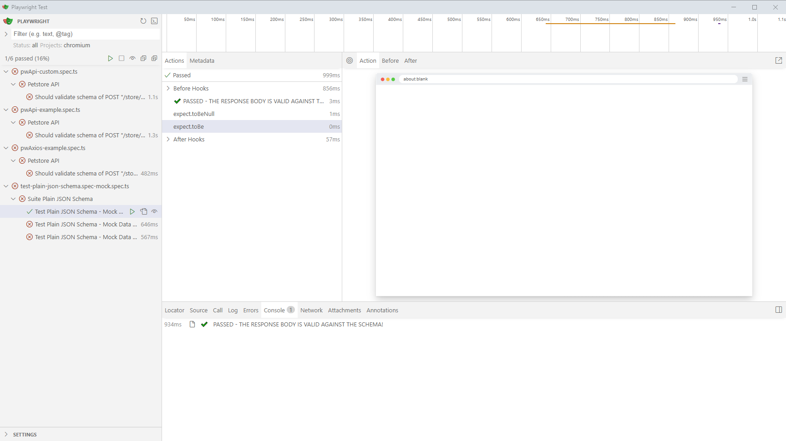
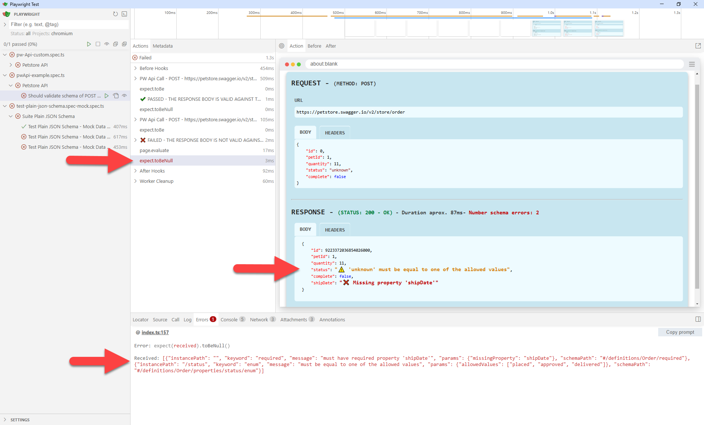
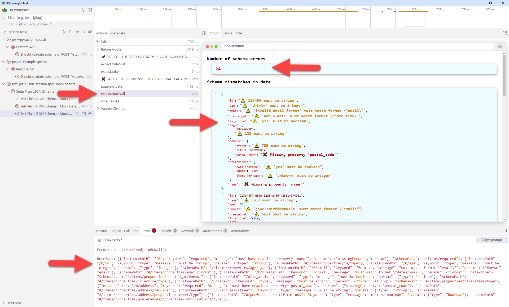
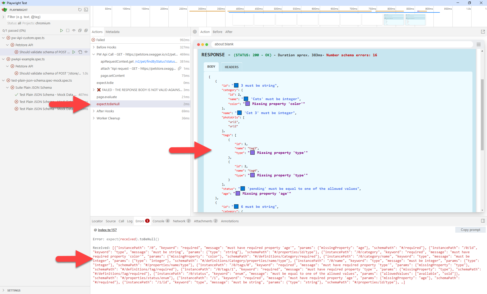
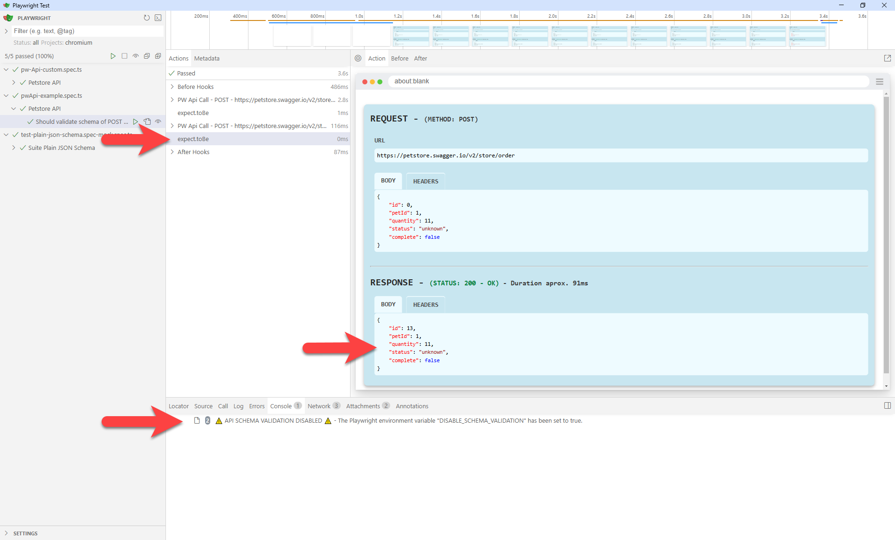
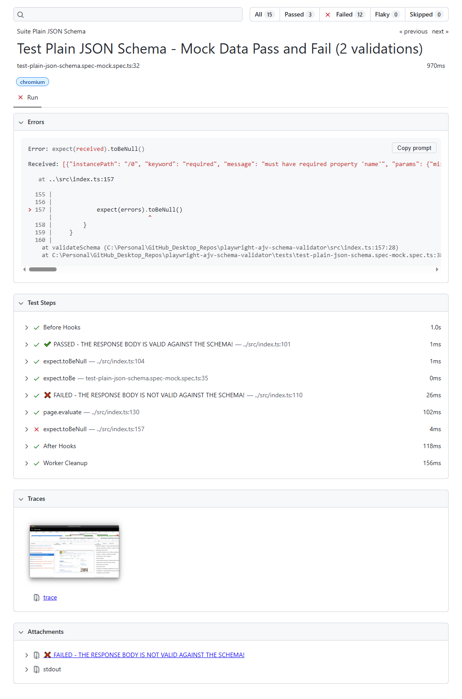
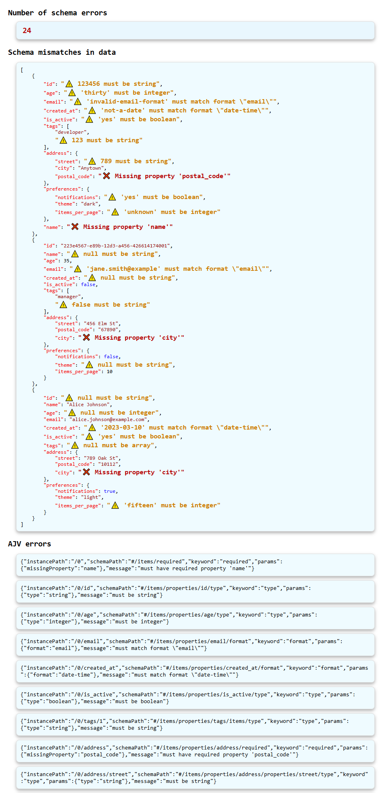
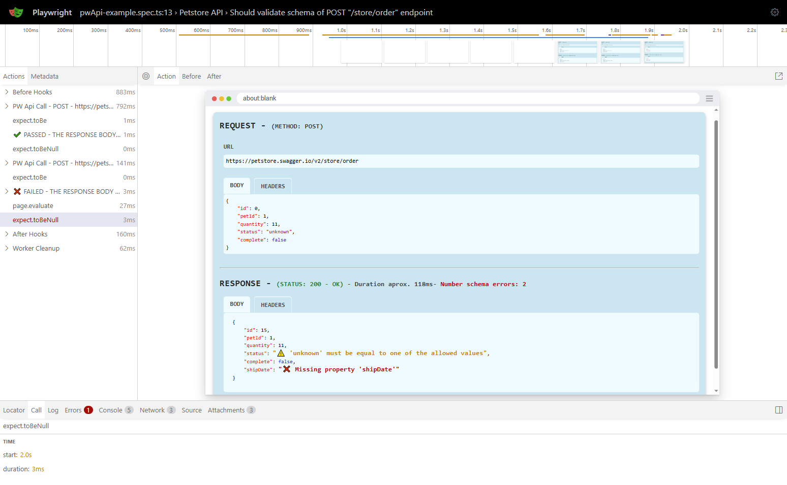
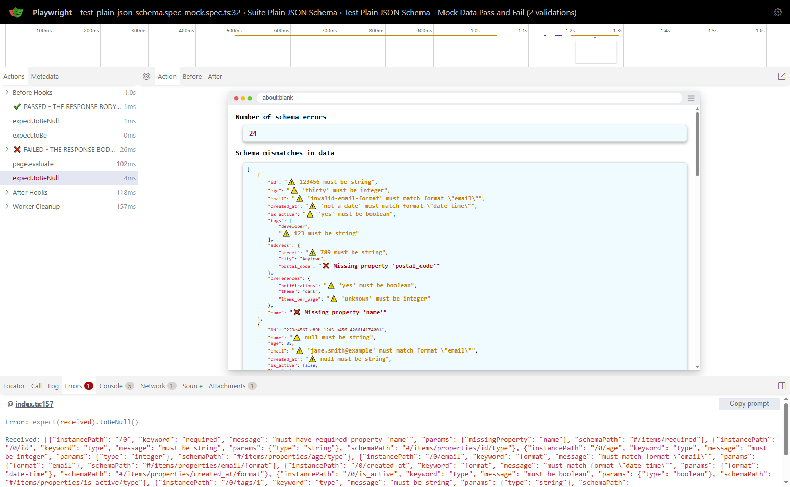

# playwright-ajv-schema-validator

Playwright plugin for API schema validation. It leverages the core-ajv-schema-validator powered by the AJV package (for plain JSON schemas, Swagger documents, and OpenAPI schemas) as well as the core-zod-schema-validator powered by the ZOD package (for Zod schemas). It delivers results in a clear, user-friendly format, simplifying the process of identifying and addressing schema issues.

> 🚀🚀🚀 **IMPORTANT NOTE: This plugin `playright-schema-validator` replaces the previously existing `playright-ajv-schema-validator`, maintaining complete backward compatibility while extending the API to support Zod schema validation capabilities.** 

 


## MAIN FEATURES

✔️ Function **`validateSchema()`** (and alias **`validateSchemaAjv()`**) performs a JSON Schema Validation and reports errors in the responses of network requests.
   - Schemas are provided as JSON objects.
   - Supports **Plain JSON schemas**, **OpenAPI 3.x schema documents** and **Swagger 2.0 schema documents**.
   - Utilizes the **core-ajv-schema-validator**, leveraging the **Ajv JSON Schema Validator** .

✔️ Fuction **`cy.validateSchemaZod()`** identifies and reports Zod schema validation errors in the responses of network requests.
   - Schemas are provided as **Zod objects**e.
   - Uses the **core-zod-schema-validator** , leveraging the **Zod Schema Validator**.
 
✔️ The functions process the responses provided by Playwright API requests.
  
✔️ Provides a user-friendly view of schema errors and mismatches between the validated data and the JSON schema, clearly highlighting where each validation error occurred and the exact reason for the mismatch:
  -  Total number of schema errors.
  -  Full list of schema errors as provided by **Ajv** or **Zod** depending on the selected function.
  -  A nested tree view of the validated data, clearly indicating the errors and where they occurred in an easy-to-understand format.

✔️ Allow custom styles (icons and text colors) to match the user's preferences for distinguishing schema errors.

✔️ Presents results to the user in a consistent format, regardless of whether the AJV Schema Validator or ZOD Validator is used.

✔️ Environment variables:
  -  `DISABLE_SCHEMA_VALIDATION` to disable schema validation in your tests even when function `validateSchema()` is present.
  -  `LOG_API_UI` to enable the display of API call details in **Playwright UI** and **Trace Viewer** .
  -  `LOG_API_REPORT` to enable the display of API call details in **HTML Report** .

- ⭐⭐⭐⭐⭐ Integrates seamlessly with the **`pw-api-plugin`** but also works independently with **standard Playwright API requests**.

&nbsp; 

## TABLE OF CONTENTS

- [playwright-ajv-schema-validator](#playwright-ajv-schema-validator)
  - [MAIN FEATURES](#main-features)
  - [TABLE OF CONTENT](#table-of-content)
  - [ABOUT JSON SCHEMAS AND AJV JSON SCHEMA VALIDATOR](#about-json-schemas-and-ajv-json-schema-validator)
    - [JSON Schema](#json-schema)
    - [OpenAPI 3.0.1 and Swagger 2.0 Schema Documents](#openapi-301-and-swagger-20-schema-documents)
    - [Ajv JSON Schema Validator](#ajv-json-schema-validator)
  - [INSTALLATION](#installation)
  - [COMPATIBILITY](#compatibility)
  - [CONFIGURATION](#configuration)
  - [API Reference](#api-reference)
    - [`validateSchema(fixtures, data, schema[, path[, issuesStyles]])`](#validateschemafixtures-data-schema-path-issuesstyles)
      - [Parameters](#parameters)
      - [Returns](#returns)
  - [USAGE](#usage)
    - [Environment variables](#environment-variables)
      - [Setting Environment Variables in the Terminal](#setting-environment-variables-in-the-terminal)
    - [Using **`pw-api-plugin`**](#using-pw-api-plugin)
      - [**`pwApi`** Class](#pwapi-class)
      - [**`axiosApi`** Class](#axiosapi-class)
    - [Using Playwright Standard Requests](#using-playwright-standard-requests)
  - [PRESENTATION OF RESULTS](#presentation-of-results)
    - [Schema Validation Pass](#schema-validation-pass)
    - [Schema Validation Fail Using **`pw-api-plugin`**](#schema-validation-fail-using-pw-api-plugin)
    - [Schema Validation Fail Using Playwright Standard API **`request`**](#schema-validation-fail-using-playwright-standard-api-request)
    - [Schema Validation Fails with Custom Styles Used in your Tests](#schema-validation-fails-with-custom-styles-used-in-your-tests)
    - [Disable Schema Validation](#disable-schema-validation)
    - [Attach Schema Validation Failure Details in HTML Report](#attach-schema-validation-failure-details-in-html-report)
    - [Schema Validation Details in Trace Viewer](#schema-validation-details-in-trace-viewer)
  - [LICENSE](#license)
  - [CONTRIBUTING](#contributing)
  - [CHANGELOG](#changelog)
    - [\[1.0.0\]](#100)

&nbsp;

## COMPATIBILITY

- Ajv 8.16.0 or higher
- ajv-formats 3.0.1 or higher
  
For Typescript projects also:
- TypeScript 4.5+
- You must enable strict mode in your `tsconfig.json`. This is a best practice for all TypeScript projects.


## INSTALLATION

```sh
npm install -D playwright-schema-validator
```


## CONFIGURATION

- Add the following line to your test file for leveraging AJV Schema Validation:

  ```js
  import { validateSchema } from 'playwright-schema-validator';
  ```
  or
  ```js
  import { validateSchemaAjv } from 'playwright-schema-validator';
  ```  

- Add the following line to your test file for leveraging ZOD Schema Validation:

  ```js
  import { validateSchemaZod } from 'playwright-schema-validator';
  ```

- Set environment variable **`DISABLE_SCHEMA_VALIDATION`** to `true` to disable the schema validation even when the `validateSchema()`, `validateSchemaAjv()`, and `validateSchemaZod()` functions are present in the test. By default, schema validation is enabled.

- Set environment variable **`LOG_API_UI`** to `true` to enable the display of schema errors on the **Playwright UI** and **Trace Viewer**. By default, these results are displayed.

- Set environment variable **`LOG_API_REPORT`** to `true` to attach the schema errors on the **HTML Report**. By default, these results are **not attached** to the report.


> ⭐⭐⭐⭐⭐ **If you are using the Playwright `pw-api-plugin` in your API tests to display API call details, the `playwright-schema-validation` plugin will automatically detect and display schema errors directly alongside the details.**


## ABOUT JSON SCHEMAS AND SCHEMA VALIDATORS

### JSON Schema

JSON Schema is a hierarchical, declarative language that describes and validates JSON data.

### OpenAPI 3.x and Swagger 2.0 Schema Documents

The OpenAPI Specification (formerly Swagger Specification) are schema documents to describe your entire API (in JSON format or XML format). So a schema document will contain multiple schemas, one for each supported combination of **_Endpoint - Method - Expected Response Status_** (also called _path_) by that API.

### Ajv JSON Schema Validator

AJV, or Another JSON Schema Validator, is a JavaScript library that validates data objects against a JSON Schema structure.

It was chosen as the core engine of the `core-ajv-schema-validator` plugin because of its versatility, speed, capabilities, continuous maintenance, and excellent documentation. For more information on Ajv, visit the [Ajv official website](https://ajv.js.org/).

Ajv supports validation of the following schema formats: **JSON Schema**, **OpenAPI 3.x** specification, and **Swagger 2.0** specification. However, Ajv needs to be provided with the specific schema to be validated for an endpoint, method, and expected response; it cannot process a full OpenAPI 3.x or Swagger 2.0 schema document by itself.

The `playwright-schema-validator` plugin simplifies this by obtaining the correct schema definition for the endpoint you want to test. You just need to provide the full schema document (OpenAPI or Swagger) and the path to the schema definition of the service you want to validate for your API (_Endpoint - Method - Expected Response Status_).

> **Note:** The Ajv instance used in this plugin (`playwright-schema-validator`) is configured with the options `{ allErrors: true, strict: false }` to display all validation errors and disable strict mode.

### Zod Schema Validator

Zod is a TypeScript-first schema declaration and validation library that allows defining schemas directly in TypeScript while providing robust type detection within your code.

It was chosen as the core engine of the `core-zod-schema-validator` plugin due to its developer-friendly nature, versatility, and seamless integration into modern TypeScript workflows. Its intuitive API, extensive validation capabilities, and active maintenance make it a powerful tool for schema validation. For more information on Zod, visit the [Zod official website](https://zod.dev/).

The `playwright-schema-validator` plugin integrates Zod by enabling developers to supply Zod schemas directly for validation. You define the schema for the service and endpoint you want to validate, and the plugin ensures that the API responses adhere to the specified structure.

&nbsp; 


## API Reference

### `validateSchema(fixtures, data, schema[, path[, issuesStyles]])` (and alias `validateSchemaAjv(fixtures, data, schema[, path[, issuesStyles]])`)

It validates the JSON data in the response body against the provided **Plain JSON schema**, **OpenAPI** and **Swagger** document format using the **AJV Schema Validator**.
Note that the function already asserts the validity of the schema, so there is no need to add additional assertions checking for types on the results.


#### Parameters

- **`fixtures`** (required)
  - **Type**: `object`
  - **Description**: An object containing test fixtures, such as the page object: `{ page }`.

- **`data`** (required)
  - **Type**: `object`
  - **Description**: The JSON data to validate against the schema.

- **`schema`** (required)
  - **Type**: `any`
  - **Description**: The schema to validate against. Supported formats include:
    - JSON Schema
    - OpenAPI 3 specification document
    - Swagger 2 specification document
    See the [Ajv JSON Schema documentation](https://ajv.js.org/json-schema.html) for more information.

- **`path`** (optional)
  - **Type**: `object`
  - **Description**: The path object to the schema definition in a Swagger or OpenAPI document. Not required if the schema is a plain JSON schema.
    - **`path.endpoint`** (required if `path` is provided)
      - **Type**: `string`
      - **Description**: The endpoint path in the Swagger or OpenAPI document.
    - **`path.method`** (optional)
      - **Type**: `string`
      - **Default**: `"GET"`
      - **Description**: The HTTP method (e.g., `GET`, `POST`) of the API request.
    - **`path.status`** (optional)
      - **Type**: `number`
      - **Default**: `200`
      - **Description**: The expected status code of the API response.

- **`issuesStyles`** (optional)
  - **Type**: `object`
  - **Description**: An optional object to override the default icons and HEX colors used to flag schema issues.
    - **`issuesStyles.iconPropertyError`** (optional)
      - **Type**: `string`
      - **Description**: Custom icon to flag property errors. Support emojis.
    - **`issuesStyles.colorPropertyError`** (optional)
      - **Type**: `string`
      - **Description**: Custom HEX color to flag property errors.
    - **`issuesStyles.iconPropertyMissing`** (optional)
      - **Type**: `string`
      - **Description**: Custom icon to indicate missing properties. Support emojis.
    - **`issuesStyles.colorPropertyMissing`** (optional)
      - **Type**: `string`
      - **Description**: Custom HEX color to indicate missing properties.

#### Returns

- **Type**: `Promise<object>`
- **Description**: A Promise resolving to an object containing the validation results:
  - **`errors`**  
    - **Type:** `array`  
    - **Description:** An array of validation errors as provided by Ajv, or `null` if the data is valid against the schema.
  - **`dataMismatches`**  
    - **Type:** `object`  
    - **Description:** The original response data with all schema mismatches directly flagged.

&nbsp; 

Example providing a **_Plain JSON schema_**:

```js
  const data = response.body
  const validationResult = await validateSchema({ page }, data, schema);
```
or
```js
  const data = response.body
  const validationResult = await validateSchemaAjv({ page }, data, schema);
```


Example providing a **_Plain JSON schema and custom `issuesStyles`_**:

```js
const issuesStylesOverride = {
  iconPropertyError: '🟦', colorPropertyError: '#5178eb',
  iconPropertyMissing: '🟪', colorPropertyMissing: '#800080'

  const validationResult = await validateSchema({ page }, data, schema, undefined, issuesStylesOverride);
```
or
```js
const issuesStylesOverride = {
  iconPropertyError: '🟦', colorPropertyError: '#5178eb',
  iconPropertyMissing: '🟪', colorPropertyMissing: '#800080'

  const validationResult = await validateSchemaAjv({ page }, data, schema, undefined, issuesStylesOverride);
```


Example providing an **_OpenAPI 3.0.1 or Swagger 2.0 schema documents and path to the schema definition_**:

```js
  const path = { endpoint: '/users/{id}', method: 'GET', status: 200 }

  const data = response.body
  const validationResult = await validateSchema({ page }, data, schemaDoc, path)
```
or
```js
  const path = { endpoint: '/users/{id}', method: 'GET', status: 200 }

  const data = response.body
  const validationResult = await validateSchemaAjv({ page }, data, schemaDoc, path)
```


Example providing an **_OpenAPI 3.0.1 or Swagger 2.0 schema documents, path to the schema definition and custom `issuesStyles`_**:

```js
  const issuesStylesOverride = {
    iconPropertyError: '🟦', colorPropertyError: '#5178eb',
    iconPropertyMissing: '🟪', colorPropertyMissing: '#800080'
  }
  const path = { endpoint: '/users/{id}', method: 'GET', status: 200 }

  const data = response.body
  const validationResult = await validateSchema({ page }, data, schemaDoc, path, issuesStylesOverride)
```
or
```js
   const issuesStylesOverride = {
    iconPropertyError: '🟦', colorPropertyError: '#5178eb',
    iconPropertyMissing: '🟪', colorPropertyMissing: '#800080'
  }
  const path = { endpoint: '/users/{id}', method: 'GET', status: 200 }

  const data = response.body
  const validationResult = await validateSchemaAjv({ page }, data, schemaDoc, path, issuesStylesOverride)
```

&nbsp; 

### `validateSchemaZod(fixtures, data, schema[,issuesStyles])` 

It validates the JSON data in the response body against the provided **Zod schema** using the **ZOD Schema Validator**.
Note that the function already asserts the validity of the schema, so there is no need to add additional assertions checking for types on the results.


#### Parameters

- **`fixtures`** (required)
  - **Type**: `object`
  - **Description**: An object containing test fixtures, such as the page object: `{ page }`.

- **`data`** (required)
  - **Type**: `object`
  - **Description**: The JSON data to validate against the schema.

- **`schema`** (required)
  - **Type**: `any`
  - **Description**: The schema to validate against. Supported format is **Zod Schema**.
    See the [Zod official website](https://zod.dev/) for more information.

- **`issuesStyles`** (optional)
  - **Type**: `object`
  - **Description**: An optional object to override the default icons and HEX colors used to flag schema issues.
    - **`issuesStyles.iconPropertyError`** (optional)
      - **Type**: `string`
      - **Description**: Custom icon to flag property errors. Support emojis.
    - **`issuesStyles.colorPropertyError`** (optional)
      - **Type**: `string`
      - **Description**: Custom HEX color to flag property errors.
    - **`issuesStyles.iconPropertyMissing`** (optional)
      - **Type**: `string`
      - **Description**: Custom icon to indicate missing properties. Support emojis.
    - **`issuesStyles.colorPropertyMissing`** (optional)
      - **Type**: `string`
      - **Description**: Custom HEX color to indicate missing properties.

#### Returns

- **Type**: `Promise<object>`
- **Description**: A Promise resolving to an object containing the validation results:
  - **`errors`**  
    - **Type:** `array`  
    - **Description:** An array of validation errors as provided by Zod, or `null` if the data is valid against the schema.
  - **`dataMismatches`**  
    - **Type:** `object`  
    - **Description:** The original response data with all schema mismatches directly flagged.

&nbsp;

Example providing a **_Zod Schema_**:

```js
  const data = response.body
  const validationResult = await validateSchemaZod({ page }, data, schema);
```


Example providing a **_Zod Schema and custom `issuesStyles`_**:

```js
const issuesStylesOverride = {
  iconPropertyError: '🟦', colorPropertyError: '#5178eb',
  iconPropertyMissing: '🟪', colorPropertyMissing: '#800080'

  const validationResult = await validateSchemaZod({ page }, data, schema, issuesStylesOverride);
```


## USAGE EXAMPLES

### Examples For AJV Schema Validation [USAGE-EXAMPLES-AJV.md](USAGE-EXAMPLES-AJV.md).

> Note: `validateSchema()` and `validateSchemaAjv()` are aliases.

- `validateSchema()` using **Playwright standard API requests**.

- `validateSchemaAjv()` using **Playwright standard API requests** and overriding `issuesStyles`.

- `validateSchema()` using **`pw-api-plugin`** with `pwApi` class.

- `validateSchemaAjv()` using **`pw-api-plugin`** with `axiosApi` class and overriding `issuesStyles`.

### Examples For ZOD Schema Validation [USAGE-EXAMPLES-ZOD.md](USAGE-EXAMPLES-ZOD.md).

- `validateSchemaZod()` using **Playwright standard API requests**.

- `validateSchemaZod()` using **Playwright standard API requests** and overriding `issuesStyles`.

- `validateSchemaZod()` using **`pw-api-plugin`** with `pwApi` class.

- `validateSchemaZod()` using **`pw-api-plugin`** with `axiosApi` class and overriding `issuesStyles`.


>>>>>>>>>>>>>>>>>>>>>>>>>>>>>>>>>>>>> -----------------------------------------------

### Using **`pw-api-plugin`**

#### **`pwApi`** Class

```js
import { expect } from '@playwright/test';
import { pwApi, test } from 'pw-api-plugin';

import { validateSchema } from 'playwright-schema-validator';

// Swagger 2.0 Schema Document for the API under test
import petStoreSwagger from '../tests-data/schemas/petstore-swagger.json';

test.describe('Petstore API', () => {

    const baseUrl = 'https://petstore.swagger.io/v2';

    test('Should validate schema of POST "/store/order" endpoint ', async ({ request, page }) => {

        // EXAMPLE POST 1 (PASS)
        const requestBody1 = {
            "id": 0,
            "petId": 0,
            "quantity": 0,
            "shipDate": "2024-01-01T00:57:29.231Z",
            "status": "placed",
            "complete": false
        }

        const responsePost1 = await pwApi.post({ request, page }, `${baseUrl}/store/order`,
            {
                data: requestBody1,
                headers: {
                    'Content-type': 'application/json; charset=UTF-8',
                },
            }
        );
        expect(responsePost1.status()).toBe(200)
        const responseBodyPost1 = await responsePost1.json()

        await validateSchema({ page }, responseBodyPost1, petStoreSwagger, { endpoint: '/store/order', method: 'post', status: 200 });


        // EXAMPLE POST 2 (FAIL: "status" not a valid value & "shipDate" is missing)
        const requestBody2 = {
            "id": 0,
            "petId": 1,
            "quantity": 11,
            "status": "unknown",
            "complete": false
        }

        const responsePost2 = await pwApi.post({ request, page }, `${baseUrl}/store/order`,
            {
                data: requestBody2,
                headers: {
                    'Content-type': 'application/json; charset=UTF-8',
                },
            }
        );
        expect(responsePost2.status()).toBe(200)
        const responseBodyPost2 = await responsePost2.json()

        await validateSchema({ page }, responseBodyPost2, petStoreSwagger, { endpoint: '/store/order', method: 'post', status: 200 });

    })
})
```

#### **`axiosApi`** Class

```js
import { expect } from '@playwright/test';
import { axiosApi, test } from 'pw-api-plugin';

import { validateSchema } from 'playwright-schema-validator';

// Swagger 2.0 Schema Document for the API under test
import petStoreSwagger from '../tests-data/schemas/petstore-swagger.json';

test.describe('Petstore API', () => {

    const baseUrl = 'https://petstore.swagger.io/v2';

    test('Should validate schema of POST "/store/order" endpoint ', async ({ request, page }) => {

        // EXAMPLE POST 1 (PASS)
        const requestBody1 = {
            "id": 0,
            "petId": 0,
            "quantity": 0,
            "shipDate": "2024-01-01T00:57:29.231Z",
            "status": "placed",
            "complete": false
        }

        const responsePost1 = await axiosApi.post({ page }, `${baseUrl}/store/order`,
            requestBody1,
            {
                headers: {
                    'Content-type': 'application/json; charset=UTF-8',
                },
            }
        );
        expect(responsePost1.status).toBe(200)
        const responseBodyPost1 = await responsePost1.data

        await validateSchema({ page }, responseBodyPost1, petStoreSwagger, { endpoint: '/store/order', method: 'post', status: 200 });


        // EXAMPLE POST 2 (FAIL: "status" not a valid value & "shipDate" is missing)
        const requestBody2 = {
            "id": 0,
            "petId": 1,
            "quantity": 11,
            "status": "unknown",
            "complete": false
        }

        const responsePost2 = await axiosApi.post({ page }, `${baseUrl}/store/order`,
            requestBody2,
            {
                headers: {
                    'Content-type': 'application/json; charset=UTF-8',
                },
            }
        );
        expect(responsePost2.status).toBe(200)
        const responseBodyPost2 = await responsePost2.data

        await validateSchema({ page }, responseBodyPost2, petStoreSwagger, { endpoint: '/store/order', method: 'post', status: 200 });

    })
})
```

### Using Playwright Standard Requests

```js
import { expect } from '@playwright/test';
import { pwApi, test } from 'pw-api-plugin';

import { validateSchema } from 'playwright-schema-validator';

// Swagger 2.0 Schema Document for the API under test
import petStoreSwagger from '../tests-data/schemas/petstore-swagger.json';

test.describe('Petstore API', () => {

    const baseUrl = 'https://petstore.swagger.io/v2';

    test('Should validate schema of POST "/store/order" endpoint ', async ({ request, page }) => {

        // EXAMPLE POST 1 (PASS)
        const requestBody1 = {
            "id": 0,
            "petId": 0,
            "quantity": 0,
            "shipDate": "2024-01-01T00:57:29.231Z",
            "status": "placed",
            "complete": false
        }

        const responsePost1 = await request.post(`${baseUrl}/store/order`,
            {
                data: requestBody1,
                headers: {
                    'Content-type': 'application/json; charset=UTF-8',
                },
            }
        );
        expect(responsePost1.status()).toBe(200)
        const responseBodyPost1 = await responsePost1.json()

        await validateSchema({ page }, responseBodyPost1, petStoreSwagger, { endpoint: '/store/order', method: 'post', status: 200 });


        // EXAMPLE POST 2 (FAIL: "status" not a valid value & "shipDate" is missing)
        const requestBody2 = {
            "id": 0,
            "petId": 1,
            "quantity": 11,
            "status": "unknown",
            "complete": false
        }

        const responsePost2 = await request.post(`${baseUrl}/store/order`,
            {
                data: requestBody2,
                headers: {
                    'Content-type': 'application/json; charset=UTF-8',
                },
            }
        );
        expect(responsePost2.status()).toBe(200)
        const responseBodyPost2 = await responsePost2.json()

        await validateSchema({ page }, responseBodyPost2, petStoreSwagger, { endpoint: '/store/order', method: 'post', status: 200 });

    })
})
```

----------------------------<<<<<<<<<<<<<<<<<<<<<<<<<<<<<


## ENVIRONMENT VARIABLES FOR RESULTS PRESENTATION

- To **disable schema validation** completely even when the `validateSchema()` function is present in the test, set the environment variable `DISABLE_SCHEMA_VALIDATION` to `true`. By default, schema validation is enabled.

- When the environment variable **`LOG_API_UI`** is set to **`"false"`**, the results of the schema validation are NOT displayed in the **Playwright UI** and **Trace Viewer** in a user-friendly format. By default, these results are shown.

> This environment variable `LOG_API_UI` is also shared with the Playwright `pw-api-plugin`.

- If the environment variable **`LOG_API_REPORT`** is set to **`"true"`**, the dresults of the schema validation are included as attachments in the **HTML Report**. By default, these results are not attached.

> This environment variable `LOG_API_REPORT` is also shared with the Playwright `pw-api-plugin`.

#### Setting Environment Variables in the Terminal

In PowerShell (Note: by default LOG_API_UI is already `"true"`):

```shell
$env:DISABLE_SCHEMA_VALIDATION="true"
$env:LOG_API_UI="true"
$env:LOG_API_REPORT="true"
npx playwright test --ui
```

In Bash:

```shell
DISABLE_SCHEMA_VALIDATION="true" LOG_API_UI="true" LOG_API_REPORT="true" npx playwright test --ui
```

In Batch

```shell
set DISABLE_SCHEMA_VALIDATION="true"
set LOG_API_UI="true"
set LOG_API_REPORT="true"
npx playwright test --ui
```

> For more information, read the official documentation on [Passing Environment Variables](https://playwright.dev/docs/test-parameterize#passing-environment-variables "Passing Environment Variables").


## SCHEMA VALIDATION RESULTS

### Schema Validation Pass ✔️

When a schema validation passes, the Actions log will show the message: "✔️ **PASSED - THE RESPONSE BODY IS VALID AGAINST THE SCHEMA!**".



### Schema Validation Fail ❌

When a schema validation fails, the Actions panel will show the message: "❌ **FAILED - THE RESPONSE BODY IS NOT VALID AGAINST THE SCHEMA!**".

When selecting the assertion for the schema validation that failed in the Actions Panel it will show in the **Playwright UI** and the **Console** tab:
- Number of schema errors.
- Schema mismatches directly in obtained data response indicating the missing fields with the symbol ❌, and the rest of the errors, like wrong data type, with the symbol ⚠️.

It will also display in the **Error** tab the list of schema errors, as provided by AJV or Zod.

#### Schema Validation Fail Using **`pw-api-plugin`**




#### Schema Validation Fail Using Playwright Standard API **`request`**




#### Schema Validation Fails with Custom Styles Used in your Tests

The **Custom Styles for Validation Errors** feature allows users to personalize the display of schema validation issues for enhanced clarity. By specifying custom styles through the issuesStyles object, users can customize icons and HEX color codes to flag specific validation errors visually.




### Disable Schema Validation

Setting environment variable `DISABLE_SCHEMA_VALIDATION` to `"true"`.




### Attach Schema Validation Failure Details in HTML Report

Setting environment variable `LOG_API_REPORT` to `"true"`.







### Schema Validation Details in Trace Viewer

Executing command `npx playwright test --trace on`.



_Schema Validation Details in Trace Viewer - Using pw-api-plugin._



_Schema Validation Details in Trace Viewer - Using Playwright Standard API request._


### Results for AJV Schema Validation vs ZOD Schema Validation

One of the significant advantages of using this plugin is that it presents results to the user in a consistent format, regardless of whether the AJV Schema Validator or ZOD Validator is used. This ensures that if the plugin's user decides to switch between validators, the results remain uniform and consistent.

This provides a layer of abstraction that manages how the results are presented, allowing the user to focus solely on the results themselves.

If we compare the results presented by the playwright-schema-plugin for AJV validation and ZOD validation side by side, we can observe that the data mismatch results displayed in the Playwright UI remain consistent. This ensures an identical user experience when identifying schema issues.

The only slight differences are the schema error properties presented in Console, as these are provided by the specific validator. This allows users to inspect the results in the original validator format, if they are more familiar with it.


## LICENSE

This project is licensed under the MIT License. See the [LICENSE](LICENSE) file for more details.


## CONTRIBUTING

First off, thanks for taking the time to contribute!

To contribute, please follow the best practices promoted by GitHub on the [Contributing to a project](https://docs.github.com/en/get-started/exploring-projects-on-github/contributing-to-a-project "Contributing to a project") page.

And if you like the project but just don't have the time to contribute, that's fine. There are other easy ways to support the project and show your appreciation, which we would also be very happy about:
- Star the project
- Promote it on social media
- Refer this project in your project's readme
- Mention the project at local meetups and tell your friends/colleagues
- Buying me a coffee or contributing to a training session, so I can keep learning and sharing cool stuff with all of you.

<a href="https://www.buymeacoffee.com/sclavijosuero" target="_blank"></a>

Thank you for your support!


## CHANGELOG

### [1.0.0]
- Initial release of `playwright-schema-validator`, supporting both AJV and ZOD schema validations.

### [playwright-ajv-schema-validator 1.0.2]
- Predecessor to the `playwright-schema-validator`

