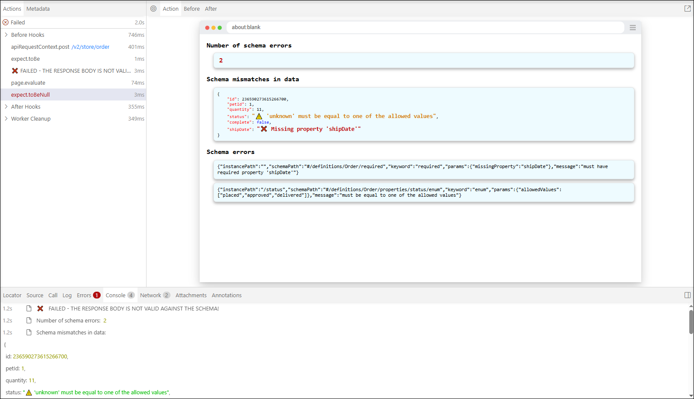
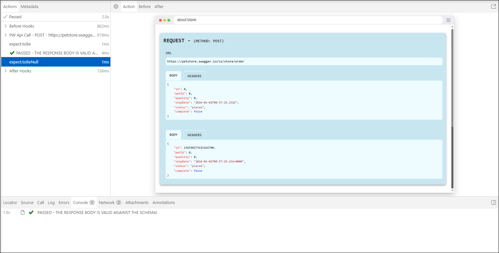

## USAGE EXAMPLES FOR AJV SCHEMA VALIDATOR

> **Note: The functions `validateSchema()` and `validateSchemaAjv()` are aliases.**

&nbsp; 

### Example: `validateSchema()` using **Playwright standard API requests - PASS**.

```javascript
    test('Should validate schema of POST "/store/order" or Playwright standard API - PASS', async ({ request, page }) => {
        const requestBody = {
            "id": 0,
            "petId": 0,
            "quantity": 0,
            "shipDate": "2024-01-01T00:57:29.231Z",
            "status": "placed",
            "complete": false
        }

        const responsePost = await request.post(`https://petstore.swagger.io/v2/store/order`,
            {
                data: requestBody1,
                headers: {
                    'Content-type': 'application/json; charset=UTF-8',
                },
            }
        );

        expect(responsePost.status()).toBe(200)
        const responseBodyPost = await responsePost.json()
        await validateSchema(
            { page },
            responseBodyPost,
            petStoreSwaggerErrors,
            { endpoint: '/store/order', method: 'post',
            status: 200 }
        );
    });
```


### Example: `validateSchema()` using **Playwright standard API requests - FAIL**.

```javascript
    test('Should validate schema of POST "/store/order" for Playwright standard API - FAIL', async ({ request, page }) => {
        const requestBody = {
            "id": 0,
            "petId": 1,
            "quantity": 11,
            "status": "unknown",
            "complete": false
        }

        const responsePost = await request.post(`https://petstore.swagger.io/v2/store/order`,
            {
                data: requestBody,
                headers: {
                    'Content-type': 'application/json; charset=UTF-8',
                },
            }
        );
        expect(responsePost.status()).toBe(200)
        const responseBodyPost = await responsePost.json()

        await validateSchema(
            { page },
            responseBodyPost,
            petStoreSwaggerErrors,
            { endpoint: '/store/order', method: 'post', status: 200 }
        );

    })
```



### Example: `validateSchemaAjv()` using **Playwright standard API requests** and overriding `issuesStyles` - FAIL.

```javascript
    test('Should validate schema AJV of POST "/store/order" for Playwright standard API and custom Styles override - FAIL', async ({ request, page }) => {
        const issuesStyles = {
            iconPropertyError: '🟦', colorPropertyError: '#5178eb',
            iconPropertyMissing: '🟪', colorPropertyMissing: '#800080'
        }

        const requestBody = {
            "id": 0,
            "petId": 0,
            "quantity": 0,
            "shipDate": "2024-01-01T00:57:29.231Z",
            "status": "placed",
            "complete": false
        }

        const responsePost = await request.post(`https://petstore.swagger.io/v2/store/order`,
            {
                data: requestBody,
                headers: { 'Content-type': 'application/json; charset=UTF-8'},
            }
        );

        expect(responsePost.status()).toBe(200)
        const responseBodyPost = await responsePost.json()

        await validateSchemaAjv(
            { page },
            responseBodyPost,
            petStoreSwaggerErrors,
            { endpoint: '/store/order', method: 'post', status: 200 },
            issuesStyles
        );
    });
```


### Example: `validateSchema()` using **`pw-api-plugin`** with `pwApi` class - PASS.

```javascript
    test('Should validate schema of POST "/store/order" for pw-api-plugin and pwApi - PASS', async ({ request, page }) => {
        const requestBody = {
            "id": 0,
            "petId": 0,
            "quantity": 0,
            "shipDate": "2024-01-01T00:57:29.231Z",
            "status": "placed",
            "complete": false
        }

        const responsePost = await pwApi.post({ request, page }, `https://petstore.swagger.io/v2/store/order`,
            {
                data: requestBody,
                headers: {
                    'Content-type': 'application/json; charset=UTF-8',
                },
            }
        );

        expect(responsePost.status()).toBe(200)
        const responseBodyPost = await responsePost.json()

        await validateSchema(
            { page },
            responseBodyPost,
            petStoreSwaggerErrors,
            { endpoint: '/store/order', method: 'post', status: 200 }
        );
    });
```




### Example: `validateSchema()` using **`pw-api-plugin`** with `pwApi` class - FAIL.

```javascript
    test('Should validate schema of POST "/store/order" for pw-api-plugin and pwApi - FAIL', async ({ request, page }) => {
        const requestBody = {
            "id": 0,
            "petId": 1,
            "quantity": 11,
            "status": "unknown",
            "complete": false
        }

        const responsePost = await pwApi.post({ request, page }, `https://petstore.swagger.io/v2/store/order`,
            {
                data: requestBody,
                headers: {
                    'Content-type': 'application/json; charset=UTF-8',
                },
            }
        );
        expect(responsePost.status()).toBe(200)
        const responseBodyPost = await responsePost.json()

        await validateSchema(
            { page },
            responseBodyPost,
            petStoreSwaggerErrors,
            { endpoint: '/store/order', method: 'post', status: 200 }
        );
    })
```


### Example: `validateSchemaAjv()` using **`pw-api-plugin`** with `axiosApi` class and overriding `issuesStyles` - FAIL.

```javascript
    test('Should validate schema AJV of POST "/store/order" for pw-api-plugin and axiosApi with custom issuesStyles - FAIL', async ({ request, page }) => {

        const issuesStyles = {
            iconPropertyError: '🟦', colorPropertyError: '#5178eb',
            iconPropertyMissing: '🟪', colorPropertyMissing: '#800080'
        }

        const requestBody = {
            "id": 0,
            "petId": 1,
            "quantity": 11,
            "status": "unknown",
            "complete": false
        }

        const responsePost = await axiosApi.post({ page }, `https://petstore.swagger.io/v2/store/order`,
            {
                data: requestBody,
                headers: {
                    'Content-type': 'application/json; charset=UTF-8',
                },
            }
        );

        expect(responsePost.status()).toBe(200)
        const responseBodyPost = await responsePost.json()
        
        await validateSchemaAjv(
            { page },
            responseBodyPost,
            petStoreSwaggerErrors,
            { endpoint: '/store/order', method: 'post', status: 200 },
            issuesStyles
        );
    })
```


