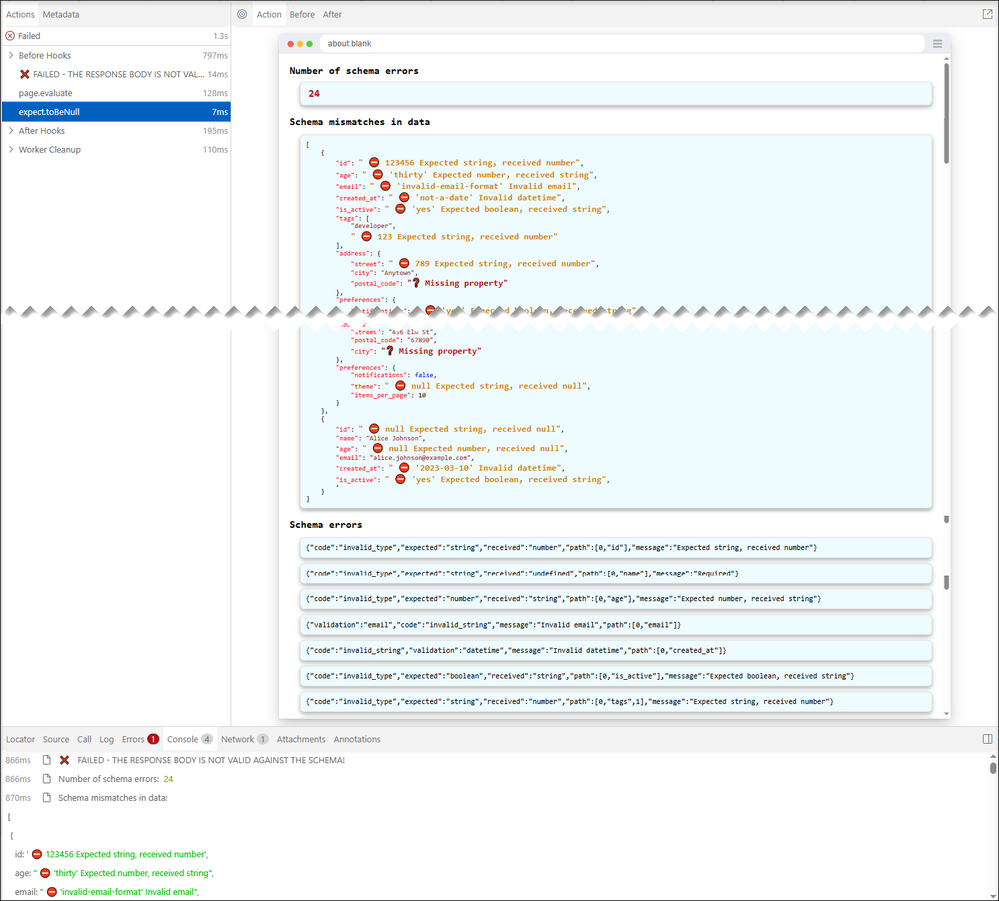
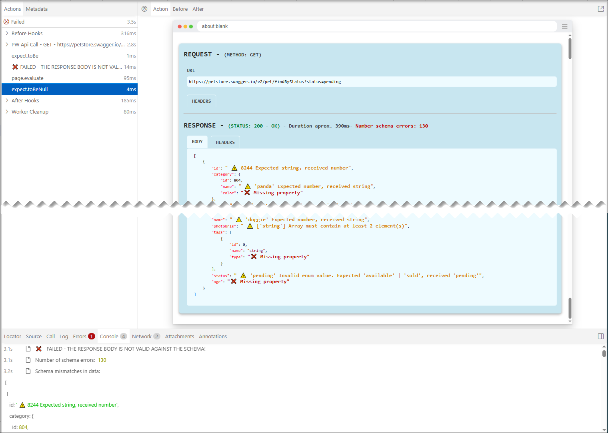

## USAGE EXAMPLES FOR ZOD SCHEMAS


### Example: `validateSchemaZod()` using **Playwright standard API requests** - FAIL.

```javascript
    test('Should validate schema ZOD of GET "/pet/findByStatus" for Playwright standard API - FAIL', async ({ request, page }) => {
        const findByStatusReq = await request.get(`https://petstore.swagger.io/pet/findByStatus?status=pending`,
            {
                headers: { 'Content-Type': 'application/json' }
            }
        );

        expect(findByStatusReq.status()).toBe(200);
        const responseFindByStatus = await findByStatusReq.json();

        await validateSchemaZod(
            { page },
            responseFindByStatus,
            petstoreSchema
        );
        
    });
```


### Example: `validateSchemaZod()` using **Playwright standard API requests** and overriding `issuesStyles` - FAIL.

```javascript
    test('Should validate schema ZOD of GET "/pet/findByStatus" for Playwright standard API and overriding `issuesStyles` - FAIL', async ({ request, page }) => {
        // Override only icons and not text
        const customStyleErrors = {
            iconPropertyError: '⛔',
            iconPropertyMissing: '❓'
        }
        const findByStatusReq = await request.get(`https://petstore.swagger.io/pet/findByStatus?status=pending`,
            {
                headers: { 'Content-Type': 'application/json' }
            }
        );

        expect(findByStatusReq.status()).toBe(200);
        const responseFindByStatus = await findByStatusReq.json();

        await validateSchemaZod(
            { page },
            responseFindByStatus,
            petstoreSchema,
            customStyleErrors
        );
    });
```




### Example: `validateSchemaZod()` using **`pw-api-plugin`** with `pwApi` class - FAIL.

```javascript
    test('Should validate schema ZOD of GET "/pet/findByStatus" for pw-api-plugin and pwApi - FAIL', async ({ request, page }) => {
        const findByStatusReq = await pwApi.get({ request, page }, `https://petstore.swagger.io/pet/findByStatus?status=pending`,
            {
                headers: { 'Content-Type': 'application/json' }
            }
        );

        expect(findByStatusReq.status()).toBe(200);
        const responseFindByStatus = await findByStatusReq.json();

        await validateSchemaZod(
            { page },
            responseFindByStatus,
            petstoreSchema
        );
    });
```




### Example: `validateSchemaZod()` using **`pw-api-plugin`** with `axiosApi` class and overriding `issuesStyles` - FAIL.

```javascript
    test('Should validate schema ZOD of GET "/pet/findByStatusr" for pw-api-plugin and axiosApi and overriding `issuesStyles` - FAIL', async ({ request, page }) => {
        const issuesStyles = {
            iconPropertyError: '🟦',
            colorPropertyError: '#5178eb',
            iconPropertyMissing: '🟪',
            colorPropertyMissing: '#800080'
        }

        const responseGet = await axiosApi.get({ page }, `https://petstore.swagger.io/v2/pet/findByStatus?status=pending`,
            {
                findByStatusReq: { 'Content-Type': 'application/json' }
            }
        )
                
        expect(findByStatusReq.status()).toBe(200);
        const responseFindByStatus = await findByStatusReq.json();

        await validateSchemaZod(
            { page },
            responseBodyGet,
            petStoreSwaggerErrors,
            issuesStyles
        );
    })
```


